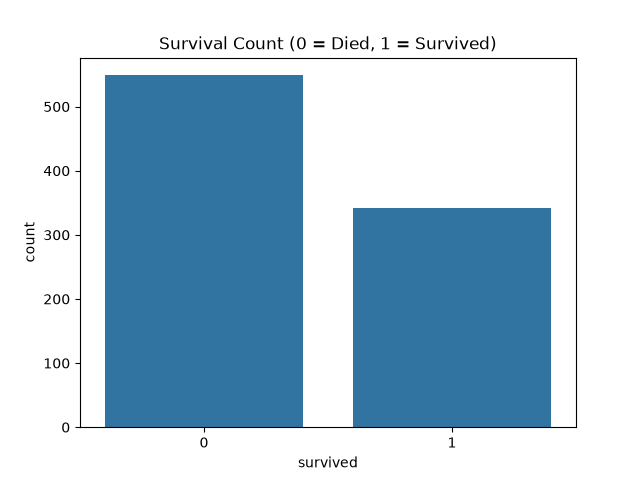
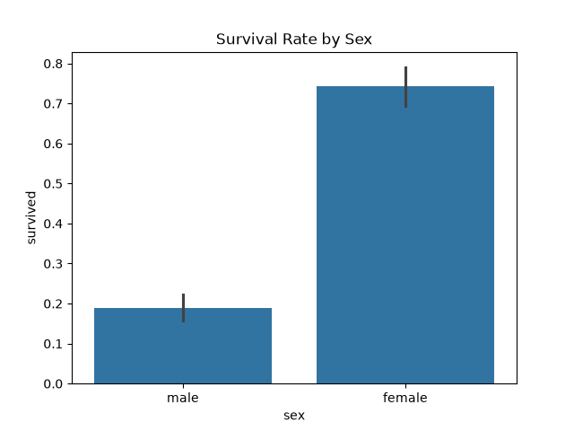
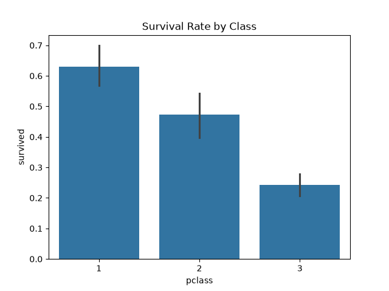
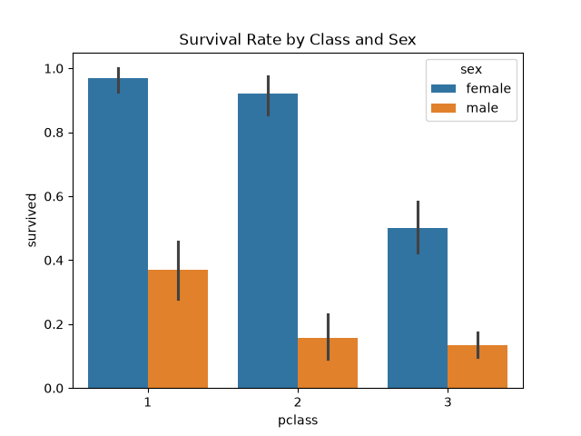

# Titanic Data Analysis

Exploratory data analysis of the Titanic passenger dataset using Python, Pandas, Matplotlib, and Seaborn.

## Objective
Analyze passenger data to identify patterns in survival rates based on sex, class, and other factors.

## Steps
1. **Explore** (`explore.py`) — loaded data, checked shape, data types, missing values
2. **Clean** (`clean_data.py`) — dropped `deck` (77% missing), filled `age` with median, filled `embarked`/`embark_town` with mode
3. **Analyze** (`analyze.py`) — computed survival rates by sex, class, and sex+class
4. **Visualize** (`visualize.py`) — generated bar charts of survival patterns

## Key Findings
- Overall survival rate: 38% (342 of 891 passengers)
- Female survival rate: 74% vs Male: 19%
- 1st class survival: 63%, 2nd class: 47%, 3rd class: 24%
- 1st class females had 97% survival rate vs 3rd class males at 14%

## Charts

## How to Run
1. Create virtual environment: `python -m venv venv`
2. Activate: `venv\Scripts\activate`
3. Install dependencies: `pip install -r requirements.txt`
4. Run scripts in order: `explore.py` → `clean_data.py` → `analyze.py` → `visualize.py`